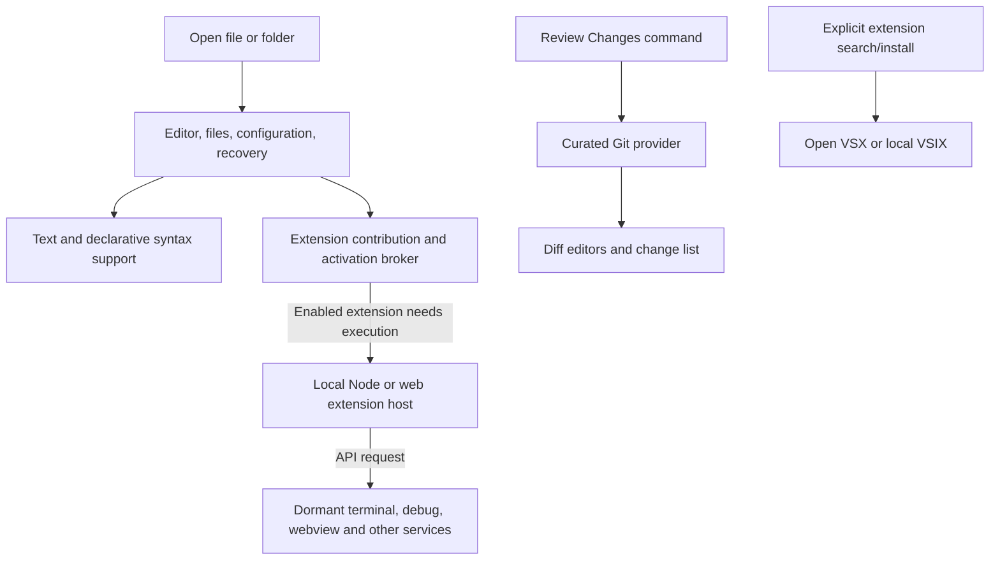

# Lean Code: implementation plan

Status: original architecture plan. Lean VS Code v0.3.2 implements the identity, quiet defaults, curated extensions, on-demand local Git activation, Open VSX, signed Apple Silicon packaging, and a signed macOS update feed. [Measured startup and idle-memory results, with v0.2.0 history](lean/docs/PERFORMANCE.md), are available for v0.3.0. Later sections still describe targets rather than verified release behavior, especially lazy extension-host startup and the 1-second/250 MiB resource targets.

Prepared: 2026-09-25.
Product name: **Lean VS Code**. Some proposed CLI and workflow examples below still use the old working name and have not been implemented.

## 1. Product decision

Build a small, local-first **Code-OSS desktop fork for editing files and reviewing Git changes**. Keep the familiar editor, keyboard shortcuts, diff viewer, and extension platform. Ship almost no executable extensions by default, remove bundled AI experiences and promotional surfaces, and start optional functionality only when requested.

The initial experience should be: launch, open a file, read or edit it, close it. Opening a project should not automatically start language servers, scan Git history, discover tasks, launch terminals, contact a registry, or suggest an agent.

The product promise is **a quiet, responsive editor with predictable resource use and optional extensions**. An Electron fork still carries Chromium and Node costs; this plan does not promise native-editor memory usage, instantaneous startup, or compatibility with every VS Code extension. Electron's process architecture establishes a baseline that removing menus cannot eliminate. [Electron process model](https://www.electronjs.org/docs/latest/tutorial/process-model)

Start with macOS Apple Silicon as the reference build and benchmark machine, while preserving upstream cross-platform code. Add Linux and Windows packaging after the core behavior passes. This is a planning assumption, not a requirement to rewrite platform support.

## 2. What the X post asks for

The linked post asks for a VS Code fork without extra features and AI, suitable for quickly inspecting code changes without agent prompts. That maps directly to this product's editing and review focus.

Evidence limitation: the original [X URL](https://x.com/theo/status/2103275983424172046) returned HTTP 403 during research. The matching text appeared in indexed copies of [Theo's TwStalker profile](https://twstalker.com/theo) and [Zamantika profile](https://zamantika.com/en/profile/theo). This is a paraphrase of those copies; replies and attached media were not verified.

## 3. Starting point and alternatives

| Approach | Decision | Reason |
| --- | --- | --- |
| Code-OSS fork with a small, maintained patch series | **Use** | Retains editor behavior and the extension platform while allowing packaging and startup changes. |
| VS Code settings/profile only | Benchmark control | Useful for proving whether our fork improves on an already quiet configuration. Settings cannot establish that code was excluded from a build. |
| VSCodium | Build/distribution reference and comparison | Reuse applicable knowledge about branding, telemetry removal, extension registries, and packaging. Establish its performance empirically. |
| Monaco in a custom Electron/Tauri/native shell | Outside this project | Monaco alone does not run VS Code extensions; rebuilding the workbench/API is a much larger project. |
| Native editor from scratch | Separate future decision | Consider only if the measured Electron floor fails the product's resource goals and extension compatibility can be relaxed. |

Fork the MIT-licensed [Code-OSS source](https://github.com/microsoft/vscode), not Microsoft's branded binaries. Preserve licenses and third-party notices and use independent application IDs, icons, CLI name, update endpoints, and storage directories. [Monaco's FAQ](https://github.com/microsoft/monaco-editor#faq) explains its extension boundary; [VSCodium](https://github.com/VSCodium/vscodium) provides a relevant distribution reference.

Choose a supported upstream **stable tag and exact commit** during implementation. Do not freeze on an old pre-AI release: that would also freeze security and platform fixes. Maintain a narrow patch series against current upstream.

## 4. Default behavior and feature boundaries

“Off by default” means **optional execution and integrations are off**, while essential editing, recovery, accessibility, and file-change correctness remain functional. It does not mean a blank editor with no useful capabilities.

| Capability | Shipped? | Default behavior / activation |
| --- | --- | --- |
| Text editing, undo, selections, tabs, split editors | Yes | Available immediately. |
| Command palette, quick open, find/replace | Yes | Available; folder enumeration/search begins on user action. |
| Syntax coloring and language configuration | Yes, declarative packages | Load relevant grammar on file open; no language server required. |
| Themes | Small light/dark set | Follow system appearance; more themes are installable. |
| Diff engine | Yes | Initialize for an explicit comparison or review. |
| Explorer and folder search | Yes | Sidebar starts hidden; watchers/search scope follows actual use. |
| Local Git review | Yes, curated provider | Starts on **Review Changes**, explicit Git command, or review CLI invocation. |
| Extension installation and management | Yes | Open VSX queries only after explicit browse/search/install action; local VSIX install works offline. |
| Language intelligence, linters, formatters | Optional packages | No bundled language-server startup; installing/enabling an extension opts into its normal activation. |
| Terminal, tasks, debugger, testing, webviews, custom editors, notebooks | Compatibility infrastructure retained | No default sessions, discovery, panels, or workers. Supporting services activate when explicitly used or requested by an enabled extension. |
| Authentication API and secret storage | Retain | No bundled account providers or sign-in prompts; providers may be installed deliberately. |
| AI chat, agents, inline AI, MCP discovery/server execution, AI onboarding | Exclude implementations and assets where dependency-safe | No provider, backend, model download, prompt, or agent process in the product. Explicit compatibility exclusions apply below. |
| Settings Sync, remote/tunnel services, cloud workspace integrations | Exclude from initial product | Local files and local worktrees only in v0.1. |
| Extension recommendations, walkthroughs, surveys, release popups | Exclude or disable at product registration | No unsolicited surfaces. |
| Telemetry, experiments, crash uploads | No active transport | Keep local diagnostics available; no product analytics or automatic uploads. |
| App/extension update checks | Manual by default | Explicit check command; optional background checks can be a later user choice. |
| Backup recovery, dirty-file protection, accessibility, workspace trust | Yes | Preserve correctness and safety behavior. |

The editor should show a compact title/tab area and status bar, with panels and sidebars collapsed until needed. Hide minimap, breadcrumbs, sticky scroll, CodeLens, inlay hints, and inline suggestions initially. Preserve settings and commands for ordinary editor preferences. Do not suppress save failures, extension failures, trust decisions, or security-relevant errors to make the UI appear quieter.

## 5. Architecture and removal strategy

### 5.1 Keep the platform; reduce what it starts



This is a logical dependency diagram, not a proposed process-per-box design. Keep upstream process isolation; do not disable sandboxing or merge extension execution into the renderer to reduce process count.

Retain the editor models, file services, configuration, commands, workspace identity, extension contribution registries, extension API/RPC layer, document synchronization, URI handling, storage, and failure recovery. Many extensions need workbench services even when their primary job appears to be formatting text.

Use three distinct optimization mechanisms, and report them separately:

1. **Product defaults:** quiet UI and no automatic optional activity. Lowest risk; no implied bundle-size saving.
2. **Lazy initialization/loading:** defer expensive imports, service construction, workers, and subprocesses until needed. Verify that startup code really stops executing.
3. **Build exclusions:** remove unneeded packages, assets, and reachable implementation code from shipping artifacts. Verify emitted bundles and runtime behavior rather than assuming tree shaking removes side effects.

### 5.2 Concrete source landmarks

Research inspected upstream `main` at [`ee2e492201c598a8169a749702a72057c6d9801e`](https://github.com/microsoft/vscode/tree/ee2e492201c598a8169a749702a72057c6d9801e). This is a **research snapshot**, not the selected release base. Recheck these paths on the chosen stable commit.

| Source area | Planned work |
| --- | --- |
| `product.json` | Independent identity/endpoints, bundled downloadable extension policy, registry configuration. |
| `build/gulpfile.extensions.ts`, `build/gulpfile.vscode.ts` | Trace extension collection and product packaging; enforce a shipping allowlist and artifact inventory. |
| `src/vs/workbench/workbench.common.main.ts` | Audit contribution registrations/imports, especially chat, inline chat, MCP, onboarding, terminal, notebooks, and debugging. |
| `src/vs/workbench/workbench.desktop.main.ts` | Audit desktop services, agent/tunnel paths, telemetry transports, and host startup. |
| `src/vs/workbench/api/` and `src/vs/workbench/services/extensions/` | Preserve extension contracts; test whether host creation can be deferred safely. |
| `extensions/git/` and `extensions/git-base/` | Remove eager activation for our bundled versions; keep ordinary Git behavior after explicit activation. |

The [upstream organization guide](https://github.com/microsoft/vscode/wiki/Source-Code-Organization) describes workbench contributions and entry points. At the inspected snapshot, common/desktop entry points directly register AI-related contributions: removing a Copilot package alone is insufficient. Both Git manifests contain `*` activation, and Git depends on `vscode.git-base`; change and test both together. [Git manifest](https://github.com/microsoft/vscode/blob/ee2e492201c598a8169a749702a72057c6d9801e/extensions/git/package.json), [Git-base manifest](https://github.com/microsoft/vscode/blob/ee2e492201c598a8169a749702a72057c6d9801e/extensions/git-base/package.json)

Do not start by deleting contribution directories. First map service imports, API bridges, commands, menus, context keys, and built-in proposed-API dependencies. Remove implementations only once dependents are adapted. Where an excluded API remains exposed for compatibility, return a clear unavailable result/error consistent with its contract; never fake successful execution.

### 5.3 Declarative language support versus executable extensions

Keep a reviewed allowlist of grammar, language-configuration, snippet, and theme packages. Treat each package's actual manifest as evidence: a package containing useful grammars may also have executable code or dependencies. Exclude bundled language-feature servers, task auto-detectors, authentication providers, remote helpers, and debug adapters initially; make suitable separately licensed packages installable later.

Maintain a versioned build-policy file recording each shipped package, its dependencies, executable entry points, reason for inclusion, and expected activation. This is build tooling, not a new user-facing configuration system.

### 5.4 Extension-host lifecycle

Aim for **no executable extension host in the clean text-only session**. This is an implementation target, not current upstream behavior: the inspected [native extension service](https://github.com/microsoft/vscode/blob/ee2e492201c598a8169a749702a72057c6d9801e/src/vs/workbench/services/extensions/electron-browser/nativeExtensionService.ts) uses eager local-process startup paths.

First eliminate unnecessary executable built-ins and eager activation. Then prototype host deferral with correctly queued activation events, dependency ordering, cancellation, startup races, and crash recovery. Keep declarative contribution scanning available before a host exists. Preserve both local Node and browser-worker host support where required by supported extensions. [Extension-host documentation](https://code.visualstudio.com/api/advanced-topics/extension-host)

Once a user enables an extension, honor its normal activation events, including startup activation when declared. Do not silently rewrite arbitrary third-party manifests. Do not repeatedly kill idle hosts: extensions can hold state and subscriptions that cannot be safely reconstructed. If safe deferral is too invasive, ship a measured lightweight host first and record the missed target explicitly. [Activation-event reference](https://code.visualstudio.com/api/references/activation-events)

## 6. Extension compatibility contract

Support **tested local extensions using the retained stable VS Code APIs**, from Open VSX or legally distributable VSIX packages. Keep the upstream API version tied to the selected source revision; publish the fork version separately. Do not advertise a newer `engines.vscode` capability than implemented.

Microsoft's current FAQ states that Code-OSS forks are not permitted to access the Visual Studio Marketplace. Therefore use [Open VSX](https://www.eclipse.org/legal/open-vsx-registry-faq/) and direct publisher distribution with appropriate licenses; a VSIX file does not itself establish permission to use or redistribute an extension. [Microsoft FAQ: marketplace and extension use](https://code.visualstudio.com/docs/supporting/faq#licensing)

Installation policy:

- No optional executable extensions are pre-enabled. No automatic import of an existing VS Code profile or extension directory.
- Use the normal, simple **Install** action to deliberately install and enable an extension; show dependencies and required reloads. Keep familiar disable/uninstall and workspace enablement controls.
- Installed extensions may start their own processes or network requests. The clean product's resource/privacy guarantees do not extend automatically to arbitrary enabled code.
- A **Review without user extensions** launch option disables third-party extension execution for that session while retaining the curated Git provider. This must be implemented separately from a blanket disable-all flag.
- Preserve workspace trust, extension verification mechanisms applicable to the chosen registry, and OS-backed secret storage. An extension host is an isolation boundary for responsiveness, not a complete permissions sandbox.

Compatibility tiers for the first release:

| Tier | Intended support | Validation |
| --- | --- | --- |
| A: themes, grammars, snippets, keymaps | Required | Declarative contributions work without executable host startup. |
| B: formatters, linters, local language servers, ordinary commands/tree views | Required | Install/activate/use/disable/reload tests, dependencies, cancellation and document events. |
| C: terminal/tasks/debugging/testing/webviews/custom editors/notebooks | Retain APIs and test representatives | Dormant by default; capability-specific fixtures prove operation when enabled. Unsupported cases must be listed. |
| D: remote authorities, Microsoft service/product dependencies, proposed/private APIs, removed AI/MCP surfaces | Outside v0.1 guarantee | Publish exclusions; do not spoof Microsoft product identity or claim universal support. |

An AI extension implemented through retained generic webview/terminal APIs may still work if deliberately installed; one requiring removed chat/model APIs may not. “No bundled AI” and “all AI extensions compatible” are different commitments. This plan makes the former.

Use a small fixture extension suite to exercise API contracts, plus a pinned representative set of real Open VSX extensions. Record exact IDs, versions, licenses, OS support, and results at implementation time rather than guessing current availability.

## 7. Review experience

Make **Review Changes** the main feature beyond editing:

1. The user chooses a local repository or opens review explicitly.
2. A compact change list shows staged, unstaged, and untracked files distinctly.
3. Selecting a file opens an inline or side-by-side diff, with next/previous change shortcuts and a whitespace toggle.
4. Branch review offers a local base reference. Label merge-base comparison separately from a direct two-ref comparison; expose the resolved commit IDs.
5. Show binary files, renames, deletions, conflicts, submodules, missing Git, and missing references explicitly. Do not silently omit them or fetch a remote to repair missing data.

Review is read-only by default. Opening the working file for editing is explicit. Commits, pushes, branch switching, and destructive discard actions are outside the v0.1 review surface; ordinary advanced Git workflows can remain in external tools or optional extensions.

Reuse upstream SCM abstractions, Git provider, and diff editors before considering a new Git implementation. Add only a thin review entry point and UI. No GitHub login, remote PR fetch, AI summary, background blame/history, automatic fetch, or recursive repository discovery is required.

Bound the workload: load the visible diff and a small adjacent cache, cancel superseded requests, limit concurrent Git work, and dispose unreferenced diff models. Refresh on relevant local changes while review is open, debounce work, and expose a manual refresh. Do not retain every visited diff indefinitely. If memory remains in an activated host after review closes, measure and report it rather than pretending the session returns to fresh-launch cost.

Review commands must avoid optional Git writes and external diff/textconv helpers where not explicitly requested. Test the index, refs, worktree files, and mtimes for unintended mutation. Use argument arrays and proper revision/path separation, never shell-interpolated filenames.

Proposed CLI contract, to implement and test rather than assumed existing syntax:

```text
lean-code file.ts
lean-code .
lean-code --diff before.ts after.ts
lean-code --review .
lean-code --review . --base main
lean-code --review . --without-user-extensions
```

`--base main` means compare the current working tree against its merge base with the specified local ref; display that meaning in the UI. Provide staged/unstaged views separately. Keep compatibility with upstream `--wait`, file:line navigation, and OS open-file handling.

## 8. Resource and network policy

Opening a file should watch that file as needed for external changes and preserve backup recovery. Opening a folder may initialize essential workspace metadata, but should not recursively index it immediately. Start search enumeration on request and respect ignore rules; create broader watchers only when a visible feature or enabled extension needs them. Preserve extension-requested watchers and document-change correctness.

Use existing large-file safeguards. For oversized or pathological files, offer plain-text/reduced-feature viewing with a clear explanation. Set bounded diff computation time and cancellation; a huge minified file must not freeze the UI.

The pristine product should initiate **zero outbound application requests** during launch, text editing, and local Git review. Audit more than telemetry: update probes, experiments, schema downloads, extension metadata, recommendations, authentication discovery, remote assets, and crash transports. Product settings alone do not prove network silence. Microsoft's documentation also distinguishes telemetry from other online services and third-party extension behavior. [VS Code FAQ](https://code.visualstudio.com/docs/supporting/faq)

Explicit online extension operations and manual update checks are allowed. Show network errors where the action occurs, with a usable retry. For offline releases, bundle registry security metadata when available and state its age; manual-only updates mean fresh revocation/security information is unavailable until a user checks. Retain local diagnostics without uploading file paths or code automatically.

## 9. Performance targets and proof

All numbers below are **initial engineering targets**, not measured claims. Calibrate once against a named Apple Silicon reference machine with 16 GB RAM and SSD, fixed OS/power settings, and optimized release builds. Set separate baselines for other platforms.

| Scenario / metric | Initial target |
| --- | --- |
| Process launch to editable small file, process-cold but filesystem-cache-warm | p95 ≤ 1.0 s |
| Open small file in an existing window | p95 ≤ 150 ms |
| Fresh empty/text-only session at 30 s idle | Whole-app memory ≤ 250 MiB |
| Local review of 100 changed text files in a 10k-file repository | First visible usable diff p95 ≤ 1.5 s; idle memory ≤ 400 MiB |
| Editing response on ordinary source files | p95 key-to-paint ≤ 16.7 ms on a 60 Hz display |
| Settled text-only idle | Average CPU ≤ 0.5% of one core over 60 s; no recurring optional scans |
| Clean text-only session runtime | No language servers, agent processes, Git scans, or terminal processes; zero executable extension hosts is a separate prototype gate |
| Review churn | After 50 open/close cycles, settled memory growth ≤ max(20 MiB, 5% of post-warm-up baseline), with no upward model/listener trend |
| Relative improvement | Aim for ≥ 20% lower clean-idle memory and ≥ 20% faster file-ready startup than matched unmodified Code-OSS; disclose misses |

Measure the **whole application process tree**, including Electron helpers, extension hosts, language servers, Git, terminals, and workers where observable. Record macOS physical footprint, Linux PSS, and Windows private bytes using a documented platform-specific method; keep RSS as a separate diagnostic and do not compare unlike metrics across OSs or double-count shared memory without disclosure.

Benchmark four matched configurations: unmodified Code-OSS at the same commit, stock VS Code with AI/telemetry/recommendations disabled, VSCodium with a clean profile, and this fork. Pin exact versions, settings, and extensions. The same-commit Code-OSS comparison is the primary causal control; compare configured real-world profiles separately.

Use at least 30 repetitions for automated warm-cache timing samples, report p50/p95 and raw samples, and separate true cold-cache/reboot trials from process restarts. Record readiness at an editor that can accept input, not only first window paint. Alternate run order to reduce cache/thermal bias. Sample network activity, CPU, memory, process inventory, and activation logs for each scenario.

Fixtures: empty launch; one 100 KiB source file; a 10k-file repository; a 100k-file stress repository; 100 mixed changes; a large diff/minified file; a linked worktree; multi-root workspaces; untrusted folders; and repeated open/close. Repeat with one language-server extension and a representative extension set, attributing their added cost separately.

If quiet stock VS Code or VSCodium performs within measurement noise of the fork, report that outcome. Continue deeper optimization only for demonstrated hotspots. Do not justify a permanent high-maintenance fork using an unfair comparison against a heavily extended installation.

## 10. Implementation sequence

Estimates assume one experienced TypeScript/Electron engineer, available CI, and no major upstream API break. They are planning ranges, not commitments. Expect roughly **6–10 weeks for a validated macOS beta**; extend the range if host deferral or compatibility work proves invasive. Initial prototype: approximately 1–2 weeks. Additional signed platforms follow measured readiness.

| Phase | Work and artifacts | Exit gate | Estimate |
| --- | --- | --- | --- |
| 0. Reproducible baseline | Select stable SHA; build unmodified Code-OSS; record toolchain; inventory processes/extensions/services; establish fixtures and benchmarks. | Baseline editor, diff and fixture extensions work; raw benchmark report saved. | 2–4 days |
| 1. Quiet distribution | Product identity, isolated storage, UI defaults, no recommendations/onboarding/auto updates; endpoint inventory; declarative extension allowlist; manual Open VSX/VSIX flow. | Fresh-profile editing works offline; no unsolicited prompts or outbound application traffic. | 3–5 days |
| 2. Exclusions and startup | Remove AI/MCP/cloud implementation roots/assets, adapt dependency bridges, lazy-load optional services, gate bundled Git activation; prototype extension-host deferral. | No AI/provider code executes or ships unintentionally; supported APIs pass; trace proves reduced startup work. Host-deferral result documented. | 1–2 weeks |
| 3. Review MVP | Review entry point, staged/unstaged/untracked lists, branch-base review, CLI, bounded diff cache, worktree/error handling. | Correct local diffs, no repository mutation, no automatic fetch, large-review responsiveness demonstrated. | 1–2 weeks |
| 4. Compatibility and performance | Contract fixtures, real extension matrix, process/network assertions, churn and regression benchmarks, targeted profiling fixes. | Required compatibility tiers pass; target deviations resolved or explicitly accepted in release scope. | 1–2 weeks |
| 5. Beta release and maintenance | Signed/notarized macOS package, checksums/SBOM/licenses, update/rollback workflow, reproducible build metadata, upstream-upgrade rehearsal. | Install/upgrade/uninstall preserve user data; fresh-machine smoke tests pass; upgrade patch series reapplies. | 3–5 days |

Phases are dependency-ordered. Begin distribution exclusions before invasive service refactoring; do not build a replacement extension framework, remote backend, or language server as part of this plan.

### Proposed repository layout

Keep upstream history in the actual fork, with project-specific material under a small `lean/` directory. This avoids a second full source copy and makes upstream merges reviewable. The fork is now based on Code-OSS `1.139.1` (`04c0d99f4fb0d8afe6ce4f0c58e31e183ac3e4b1`); `main` is the Lean VS Code product branch.

```text
src/, extensions/, build/, ...      upstream Code-OSS tree
lean/
  product/                         identity, defaults, extension allowlist
  docs/                            decisions, compatibility, release runbook
  scripts/                         build-policy checks and artifact inventory
  tests/                           default behavior and extension fixtures
  benchmarks/                      fixtures, harness, raw results, reports
```

Use separate commits for branding/defaults, package selection, contribution removal, activation changes, and review UX. Record rationale and upstream dependencies for every core patch. Add a CI report that flags newly introduced upstream executable built-ins, contribution roots, endpoints, and eager services for classification; this prevents features reappearing silently on upgrade.

### First implementation backlog

- [ ] Pin stable upstream SHA, toolchain and lockfile; build a release-mode baseline. (The SHA and toolchain are pinned; the unmodified comparison build remains.)
- [ ] Capture baseline process tree, memory, file-ready time and extension activations.
- [ ] Inventory product endpoints, shipping extensions and contribution roots.
- [x] Establish independent identity and user-data/extension directories.
- [x] Enforce a declarative package allowlist and quiet product defaults.
- [ ] Prove zero clean-session outbound requests and no automatic Git/language activity.
- [ ] Resolve AI/MCP dependencies and verify build exclusions in output artifacts.
- [ ] Add explicit Git/review activation covering both Git built-ins.
- [ ] Prototype host deferral; keep a measured fallback if compatibility fails.
- [ ] Implement Review Changes and the proposed CLI contract.
- [ ] Run compatibility, large-repository, recovery, accessibility, and performance gates.
- [ ] Package beta and rehearse one upstream security/update merge.

## 11. Required verification and release policy

Use upstream unit/integration/smoke tests relevant to changed services, plus narrow new tests for the changed lifecycle and product contract. Do not replace runtime proof with screenshots of hidden UI.

Required acceptance evidence:

- **Editing:** Unicode/IME, keyboard navigation, accessibility, undo/redo, dirty buffers, external edits, crash recovery, read-only files and large-file fallback.
- **Defaults:** first launch and subsequent launches; no AI menus/prompts, optional execution, auto-installation, inherited user extensions, or background registry/update requests.
- **Extensions:** declarative metadata before activation; command/language/startup activation; dependencies; Node and web hosts; disable/reload; crash recovery; retained capability fixtures.
- **Review:** empty/unborn repos, staged plus unstaged edits to one file, untracked files, renames/deletions, binary files, conflicts, linked worktrees, submodules, unusual filenames, canceled diffs and missing base refs. Compare displayed content to expected Git snapshots.
- **Resource correctness:** process traces, activation logs, bounded caches, no persistent child processes after app exit, no monotonic memory growth, and fresh-profile network capture.
- **Distribution:** licenses, independent identity, signatures, clean-machine install, upgrade preserving settings/disabled states, rollback and CLI behavior.

Track supported upstream releases and Electron security updates regularly; triage important fixes immediately. Each update must reapply the patch series, rerun contract tests and benchmarks, and inspect feature/endpoint drift. Never use a product upgrade to re-enable an extension or integration the user disabled.

Publish exact upstream SHA, fork commit, build toolchain, artifact hashes, extension inventory, compatibility results, benchmark methodology/results, and known limits for each release. Keep a prior signed release available for rollback without deleting user data. Signing, publishing, and remote repository creation are later implementation/release work; this document performs none of them.

## 12. Main risks and decision gates

| Risk | Response / decision gate |
| --- | --- |
| Electron baseline prevents desired memory budget | Measure in Phase 0 and after package/startup changes. Reconsider architecture only with evidence and an explicit compatibility tradeoff. |
| Deep removals break extension APIs | Retain dormant compatibility infrastructure; test contracts before accepting a patch; narrow unsupported tiers explicitly. |
| AI code is intertwined with Git or shared services | Trace actual pinned-source dependencies; isolate product implementations without broad deletion of shared editor services. |
| Extensions consume most real-world resources | Attribute cost, offer review without user extensions, and keep opt-in behavior clear. Do not promise a universal memory cap. |
| Git scanning dominates startup/review | Explicit activation, bounded discovery, debounced updates, cancellation, lazy diff models and large-repository fixtures. |
| Fork maintenance outweighs measurable benefit | Compare against quiet baseline products and rehearse upgrades before beta; prefer small patches over custom frameworks. |
| Manual updates leave old code or registry metadata | Provide a clear manual check flow, visible version/security information and documented opt-in update policy. |

**v0.1 is ready when a fresh install opens and edits local files quietly, reviews changes correctly on demand, runs the tested extension set, and has published measurements showing its actual costs.** All numerical performance claims must come from those measurements.
