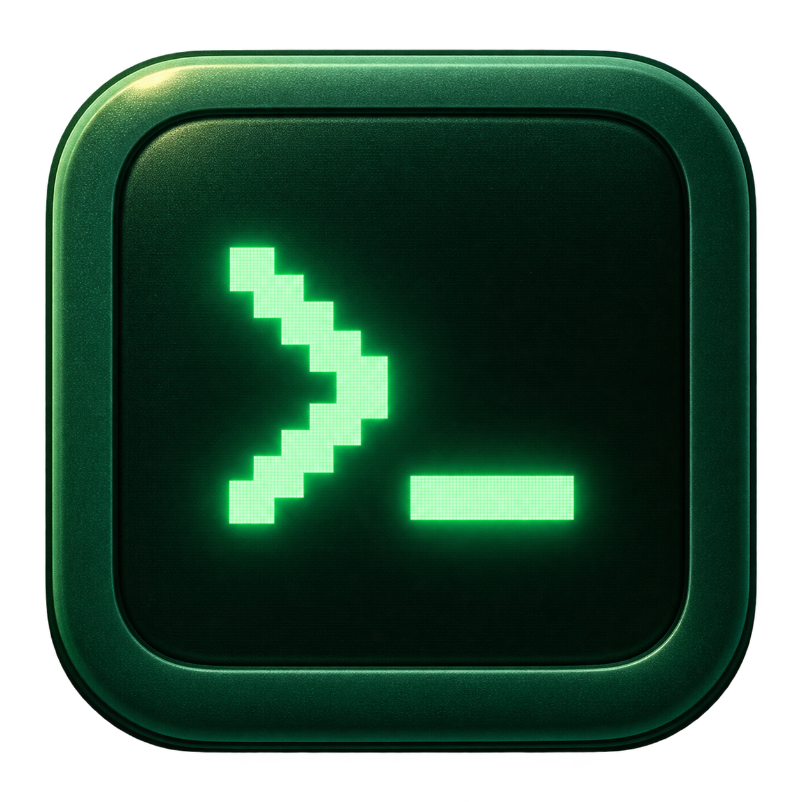
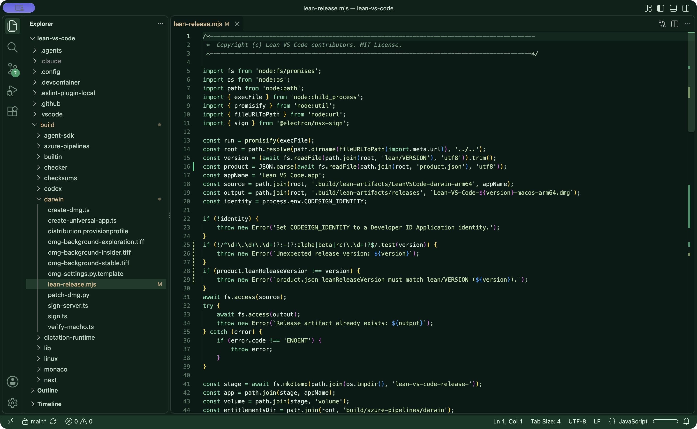
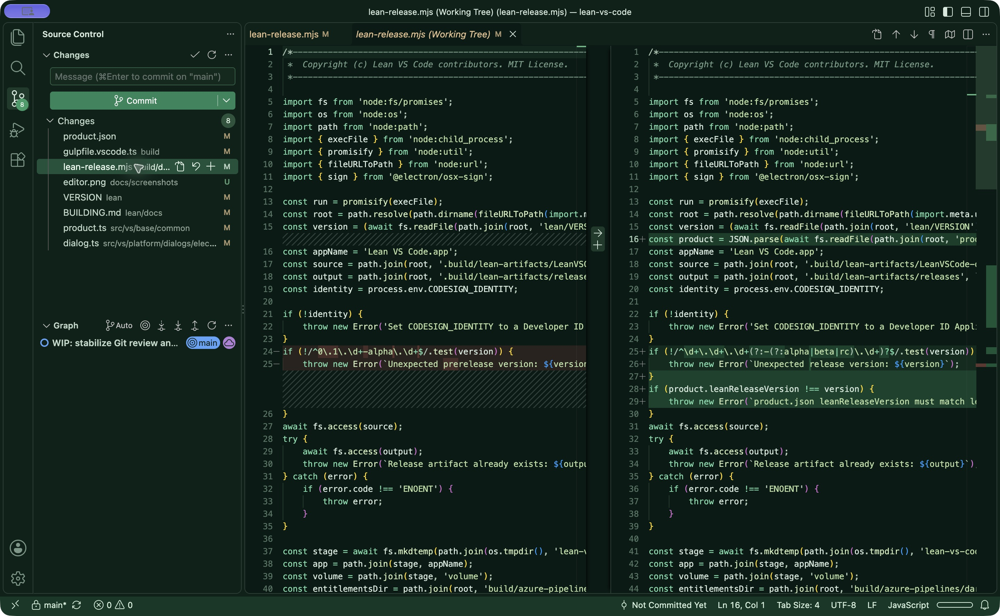

# Lean VS Code



**A quieter Code-OSS editor for writing code and reviewing local changes.** Lean VS Code is a free, open-source fork of [Code - OSS](https://github.com/microsoft/vscode). It keeps the familiar editor, search, terminal, Git diff view, and extension platform, while shipping with a smaller set of built-in extensions and fewer unsolicited surfaces. It has its own app identity and data directory, so it can live beside Visual Studio Code.

## Get v0.3.2

The current release supports **Apple Silicon Macs**. Download the signed and notarized [v0.3.2 DMG](https://github.com/mattivilola/lean-vs-code/releases/tag/v0.3.2), open it, and drag **Lean VS Code** into **Applications**. Launch it from Applications and open a file or folder. It does not replace your existing VS Code installation or import its extensions automatically. If you have v0.3.0 or the withdrawn v0.3.1 candidate, install v0.3.2 once by hand; neither can receive this update automatically.

Starting with v0.3.2, the macOS app checks its **GitHub stable-release feed** after startup and periodically while running. It downloads an update ZIP containing the signed and notarized app when a newer release is available and offers **Restart to Update**; a staged update can also install on normal quit. Choose `update.mode` in Settings to use automatic, startup-only, manual, or no future checks. Previously staged updates may still apply after checks are disabled. Initial installs remain available as DMGs on the [Releases page](https://github.com/mattivilola/lean-vs-code/releases).

See the [changelog](CHANGELOG.md) for what changed in each release, including the withdrawn v0.3.1 candidate. For a source build and the maintainer's signing/notarization procedure, see [Build and release on macOS](lean/docs/BUILDING.md).

## Why this fork exists

On our Apple M3 Max reference Mac, the signed v0.3.0 build reached an **editable file 18% sooner** and used **13% less idle app-tree memory** than a build of the original Code-OSS **at the same upstream revision**. The median results were **1.64 s versus 2.00 s** and **746 MiB versus 854 MiB**. These are warm-cache, isolated-profile measurements for a 100 KiB text file, not promises for every Mac or project. v0.3.2 adds the updater; these numbers are v0.3.0 measurements, not a fresh v0.3.2 benchmark. See the [method, raw public results, and version history](lean/docs/PERFORMANCE.md).

- **Editing and review first.** Open a file, navigate a project, inspect local Git changes, and compare them side by side without an AI prompt or onboarding flow taking over the workbench.
- **Small default extension set.** The [33 bundled extensions](lean/bundled-extensions.json) provide syntax, themes, and local Git. Only Git and Git Base have executable entry points in the packaged set. Add language servers, formatters, and other tools when you need them.
- **Extensions remain available.** The Extensions view uses [Open VSX](https://open-vsx.org/) for deliberate searches and installs, with verification against its pinned Ed25519 public key. Local VSIX installation is also supported. Extensions may have their own resource use and network behavior.
- **A separate, recognizable app.** The emerald theme and icon make it easy to distinguish from VS Code; independent storage keeps settings and installed extensions separate.
- **Less shipped development baggage.** Release packaging removes generated JavaScript source maps from the app copy, saving about 227 MiB of uncompressed disk space in this build. This does not by itself reduce runtime memory or prove faster startup.
- **Git when you ask for it.** The bundled Git extension waits until you open Source Control, a Git resource, or a Git command instead of activating merely because a folder contains `.git`. Repository review remains available on demand. This v0.3.0 change has not shown a meaningful file-ready startup improvement against v0.2.0 in direct trials.
- **Updates with the same controls you already know.** The existing update UI uses Electron's macOS updater, a signed and notarized app ZIP on GitHub Releases, and a static feed containing the ZIP's hash and size. Checks begin after the workbench opens; metered connections defer automatic work.





The screenshots show this fork's own source and its local Git change view.

## What to expect

Lean VS Code v0.3.2 is based on Code-OSS **1.139.1** and keeps that extension API version; **0.3.2** is this fork's release number. Core editor features, file search, integrated terminal, local Git review, and extension management remain available. Optional extensions are not installed by default. Telemetry, experiments, extension recommendations, and built-in AI prompts are disabled in the shipped default configuration. The macOS update feed is the one background service enabled by default; user-installed extensions can add their own functionality or traffic.

This is an early release, not a claim of native-editor memory use or universal VS Code extension compatibility. The [implementation plan's](IMPLEMENTATION_PLAN.md) 1-second file-ready and 250 MiB idle targets remain unmet. The next optimization work should profile real startup and memory costs, then defer optional services without breaking the extension API, editing safety, or Git review.

## Build from source

On an Apple Silicon Mac with Xcode command-line tools and Node.js 24.18.0 or newer within major version 24:

```sh
nvm use
npm ci
npm run gulp vscode-darwin-arm64
```

Open `.build/lean-artifacts/LeanVSCode-darwin-arm64/Lean VS Code.app`. The build downloads Electron and compiles native modules, so allow several gigabytes of free space. See [the build guide](lean/docs/BUILDING.md) for signing and notarization. Source code, build scripts, and the curated extension policy are in this repository.

## Project and license

The product branch is `main`; `upstream` tracks [microsoft/vscode](https://github.com/microsoft/vscode). Upstream updates are incorporated after compatibility and release checks. Issues and focused contributions are welcome.

Lean VS Code is an independent community fork, not Microsoft's Visual Studio Code distribution. Code-OSS and fork changes are available under the [MIT license](LICENSE.txt); Microsoft and third-party notices remain in the source and [third-party notices](ThirdPartyNotices.txt). Microsoft's Visual Studio Marketplace is not the default registry for this fork.
