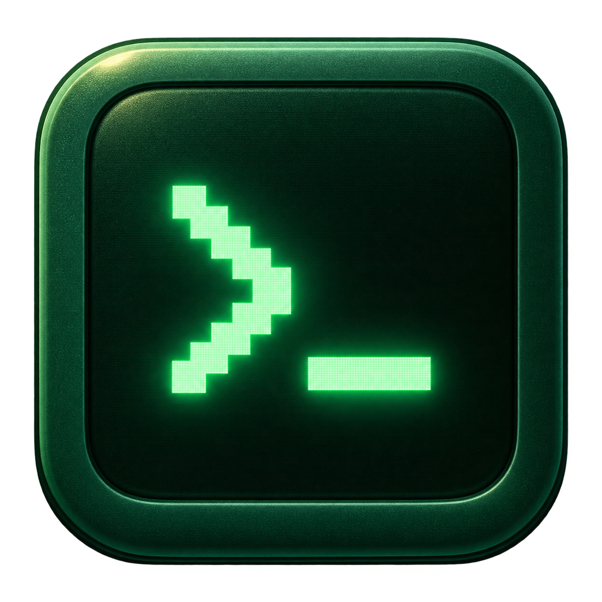
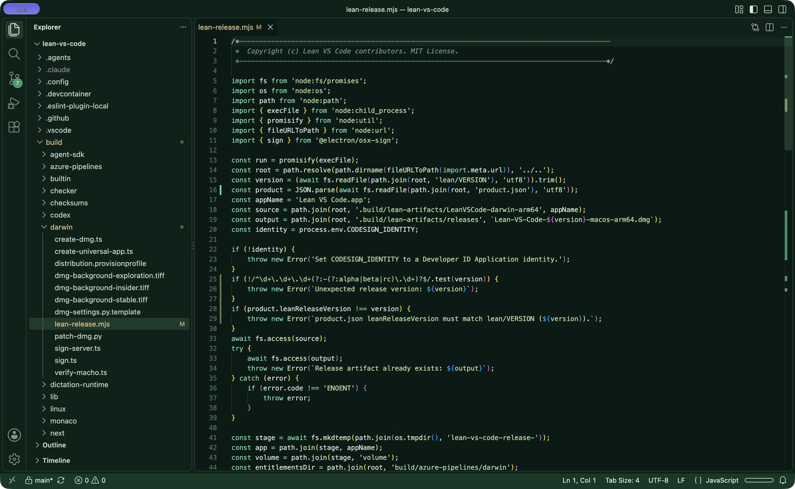
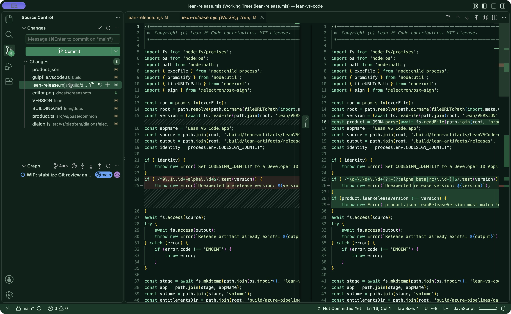

# Lean VS Code



**A quieter Code-OSS editor for writing code and reviewing local changes.** Lean VS Code is a free, open-source fork of [Code - OSS](https://github.com/microsoft/vscode). It keeps the familiar editor, search, terminal, Git diff view, and extension platform, while shipping with a smaller set of built-in extensions and fewer unsolicited surfaces. It has its own app identity and data directory, so it can live beside Visual Studio Code.

## Get v0.10.0

The current release supports **Apple Silicon Macs**. Download the signed and notarized [v0.10.0 DMG](https://github.com/mattivilola/lean-vs-code/releases/tag/v0.10.0), open it, and drag **Lean VS Code** into **Applications**. It has its own settings and extensions, so it can run alongside VS Code. Releases since v0.3.2 can receive signed updates through the app; v0.3.0 and the withdrawn v0.3.1 candidate need a manual install of v0.3.2 or newer once.

Starting with v0.3.2, the macOS app checks its **GitHub stable-release feed** after startup and periodically while running. It downloads an update ZIP containing the signed and notarized app when a newer release is available and offers **Restart to Update**; a staged update can also install on normal quit. Choose `update.mode` in Settings to use automatic, startup-only, manual, or no future checks. Previously staged updates may still apply after checks are disabled. Initial installs remain available as DMGs on the [Releases page](https://github.com/mattivilola/lean-vs-code/releases).

See the [changelog](CHANGELOG.md) and [v0.10 release notes](lean/docs/RELEASE_NOTES_0.10.0.md) for what changed and how the signed app was checked. For a source build and the maintainer's signing/notarization procedure, see [Build and release on macOS](lean/docs/BUILDING.md).

## Why this fork exists

Lean VS Code keeps the editor, project search, terminal, local Git review, and optional extensions while removing the built-in chat and agent panes. Git activates after startup in trusted projects, so branch and change indicators are ready when you review an edit.

In 30 alternating GUI pairs on an Apple M3 Max, **signed v0.10.0** reached an extension-editable file from a stopped app in **1.471 s median**, versus **1.903 s** for the original same-revision, minified Code-OSS source build: **23% less time**. The p95 was **1.596 versus 2.141 s**. The [raw observations and method](lean/performance/v0.10.0-vs-code-oss-1.139.1-minified.json) include a slightly slower existing-window median (416 versus 403 ms). A separate signed v0.6.0 trial completed a first saved edit in **1.468 versus 1.959 s**, a **491 ms / 25%** shorter launch-to-save workflow; it remains a historical result. The comparator is a locally repaired Code-OSS source package, not Microsoft's VS Code distribution.

The signed v0.10.0 app bundle is **64.9% smaller** by apparent file content: **514 versus 1,463 MiB** for that same-revision Code-OSS package. The [size report](lean/performance/v0.10.0-bundle-size-vs-code-oss-1.139.1-minified.json) shows what was counted. This is an app-bundle disk comparison, not a download-size or runtime-memory claim. An earlier, separately measured [v0.4.0 short-idle trial](lean/performance/v0.4.0-independent-memory-vs-code-oss-1.139.1-minified.json) found a **17% lower** app-tree footprint in all nine pairs. A [new v0.10.0 nine-pair trial](lean/performance/v0.10.0-independent-memory-vs-code-oss-1.139.1-minified.json) measured 395 versus 524 MiB median, but three pairs favored Code-OSS as GPU footprint modes varied; it is not a stable memory-saving claim.

The [performance history](lean/docs/PERFORMANCE.md) keeps raw Code-OSS comparisons, failures, older release results, and benchmark limits. The [optimization ledger](lean/docs/OPTIMIZATION_LEDGER.md) records shipped changes, rejected experiments, and the next work toward a sub-second editable-file p95. Routine patch and minor releases use focused regression checks; the full paired GUI comparison runs only for major releases or when explicitly requested. The v0.10.0 comparison was run at the owner's request. The [v0.11 development record](lean/docs/V0.11_STARTUP_INVESTIGATION.md) tracks the next optional-code boundary, lifecycle fixes and rejected trials; it makes no new release-speed claim.

- **Editing and review first.** Open a file, navigate a project, inspect local Git changes, and compare them side by side without an AI prompt or onboarding flow taking over the workbench.
- **Small default extension set.** The [33 bundled extensions](lean/bundled-extensions.json) provide syntax, themes, and local Git. Only Git and Git Base have executable entry points in the packaged set. Add language servers, formatters, and other tools when you need them.
- **Extensions remain available.** The Extensions view uses [Open VSX](https://open-vsx.org/) for deliberate searches and installs, with verification against its pinned Ed25519 public key. Local VSIX installation is also supported. Extensions may have their own resource use and network behavior.
- **A separate, recognizable app.** Choose **Lean VS Code Dark** or the daylight-friendly **Lean VS Code Light** from the Color Theme picker; the emerald theme and icon make the app easy to distinguish from VS Code. Independent storage keeps settings and installed extensions separate.
- **Less shipped development baggage.** Release packaging removes generated JavaScript source maps from the app copy. The v0.10.0 release continues to omit the unused separate Agents-window resources while retaining the optimized production bundle. Package size alone does not prove a runtime-memory saving.
- **Git ready after startup.** In trusted projects, the bundled Git extension starts after the workbench is ready. Gutter markers, branch status, and local diffs are available without opening Source Control first.
- **Updates with the same controls you already know.** The existing update UI uses Electron's macOS updater, a signed and notarized app ZIP on GitHub Releases, and a static feed containing the ZIP's hash and size. Checks begin after the workbench opens; metered connections defer automatic work.





The screenshots show this fork's own source and its local Git change view.

## What to expect

Lean VS Code v0.10.0 is based on Code-OSS **1.139.1** and keeps that extension API version; **0.10.0** is this fork's release number. Core editor features, file search, integrated terminal, local Git review, and extension management remain available. Optional extensions are not installed by default. Telemetry, experiments, and extension recommendations are off by default; built-in chat and agent UI are removed. Extension APIs remain registered, although an installed extension that depends on the removed built-in AI UI may need its own interface. The macOS update feed is the one background service enabled by default; user-installed extensions can add their own functionality or traffic.

This is an early release, not a claim of native-editor memory use or universal VS Code extension compatibility. The [implementation plan's](IMPLEMENTATION_PLAN.md) 1-second file-ready and 250 MiB idle targets remain unmet: signed v0.10.0 reached 1.596 s p95 in its matched run. The next optimization work needs a larger measured critical-path reduction. Core editing and extension compatibility remain release gates.

## Build from source

On an Apple Silicon Mac with Xcode command-line tools and Node.js 24.18.0 or newer within major version 24:

```sh
nvm use
npm ci
npm run gulp vscode-darwin-arm64
```

Open `.build/lean-artifacts/LeanVSCode-darwin-arm64/Lean VS Code.app`. The build downloads Electron and compiles native modules, so allow several gigabytes of free space. See [the build guide](lean/docs/BUILDING.md) for signing and notarization. Source code, build scripts, and the curated extension policy are in this repository.

## Project and license

The product branch is `main`; `upstream` tracks [microsoft/vscode](https://github.com/microsoft/vscode). Upstream updates are incorporated after compatibility and release checks. Issues and focused contributions are welcome.

Lean VS Code is an independent community fork, not Microsoft's Visual Studio Code distribution. Code-OSS and fork changes are available under the [MIT license](LICENSE.txt); Microsoft and third-party notices remain in the source and [third-party notices](ThirdPartyNotices.txt). Microsoft's Visual Studio Marketplace is not the default registry for this fork.
